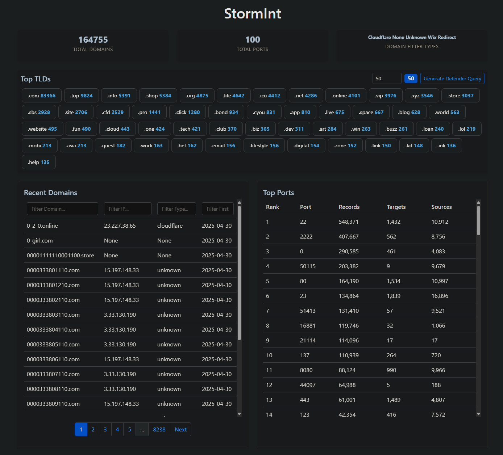

# StormInt TLD Query Generator

This project generates Microsoft Defender threat hunting queries based on TLD (Top-Level Domain) data from the SANS Internet Storm Center / DShield API. These queries help security teams identify potentially malicious domains in their email traffic.

## Generated Queries
The latest threat hunting queries are automatically generated every 3 hours using a GitHub workflow that parses the DShield API:

1. [URL TLD Query](generated/stormint_url_tld_query.kql) - Hunts for suspicious TLDs in email links
2. [Sender TLD Query](generated/stormint_sender_tld_query.kql) - Hunts for suspicious TLDs in sender domains

Both queries exclude common legitimate TLDs (.com, .net, .org, .nl) to focus on potentially malicious domains that may indicate phishing, malware distribution, or other security threats.

## Screenshot



## Update Frequency
The TLD data is automatically updated every 3 hours using the DShield API. This ensures that the generated threat hunting queries are based on the most recent threat intelligence.

## Legal Notice

### Data Source Attribution
This project uses data from the SANS Internet Storm Center / DShield API, which is provided "as-is" on a "best-effort" basis.

### Usage Terms
- This project is for educational, research, and network protection purposes
- The generated threat hunting queries are not guaranteed to be accurate or complete
- Do not build mission-critical applications around this data
- Do not resell or commercially redistribute the data
- Always validate queries in your own environment before deployment
- In case of API rate limiting (429 responses), respect the "Retry-After" header
- Consider contributing data by running a honeypot
- Please let SANS know how you use the data
- For complete API usage terms, see [DShield API Documentation](https://www.dshield.org/api/)

### Commercial Use
The API terms explicitly allow:
- Using the data for commercial purposes to protect your own company's network
- Building security tools and threat hunting queries for internal use
- Implementing network protection measures based on the data

### Disclaimer
This project is not affiliated with or endorsed by SANS Institute or the Internet Storm Center. The generated threat hunting queries are provided "as-is" without any warranty of any kind, either expressed or implied.

## User-Agent Information
This project uses a custom User-Agent for API requests:
```
StormInt
```

## License
This project is licensed under the [Creative Commons Attribution-NonCommercial-ShareAlike 4.0 International (CC BY-NC-SA 4.0) License](https://creativecommons.org/licenses/by-nc-sa/4.0/) - see the [LICENSE](LICENSE.md) file for details. 