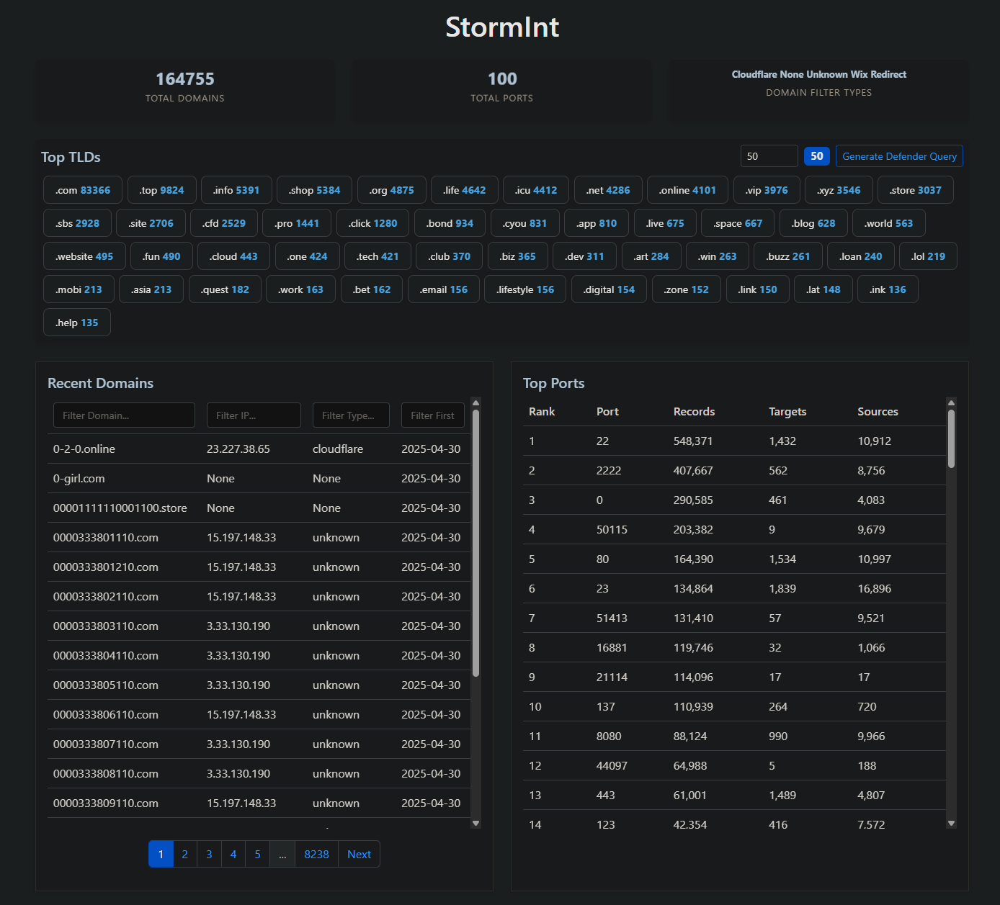

# Storm Intelligence

A web application for monitoring and analyzing domain intelligence data.

## Screenshot

## Features

- Real-time domain monitoring
- TLD statistics and analysis
- Recent domain tracking
- Email event analysis

## Installation

1. Clone the repository
2. Install dependencies
3. Run the application

## Usage

Access the dashboard at `http://localhost:5000`

## License

MIT 